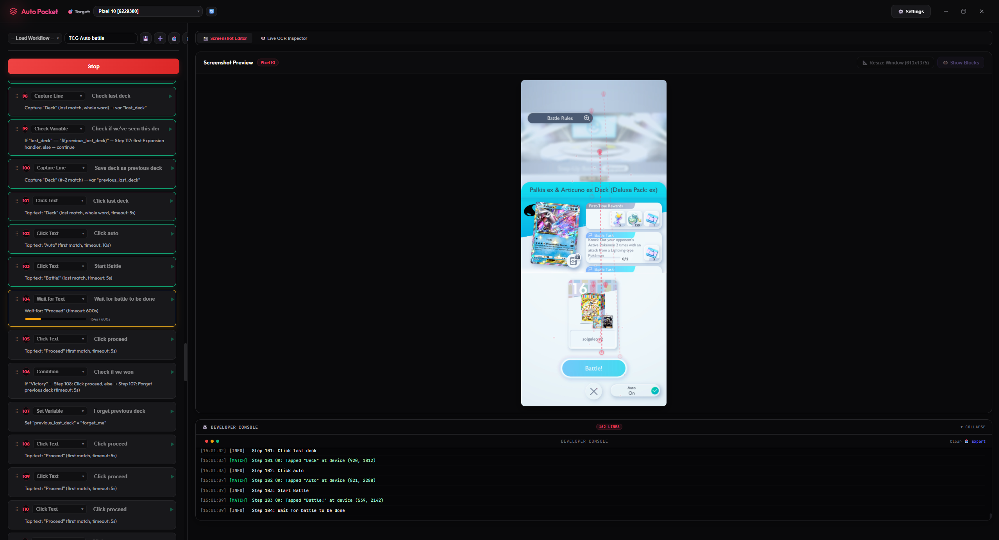

Disclaimer: This is just vibe coded slop because I didn't care about the code quality.

My current use case for this is to through all TCGP solo battles for every expansion and complete all of them. Didn't feel like manually clicking buttons for several hours...

Can be adapted to basically control anything though

- windows only (uses windows built-in ocr)
- can interact with the adb interface (tap/swipe gestures) for android devices
